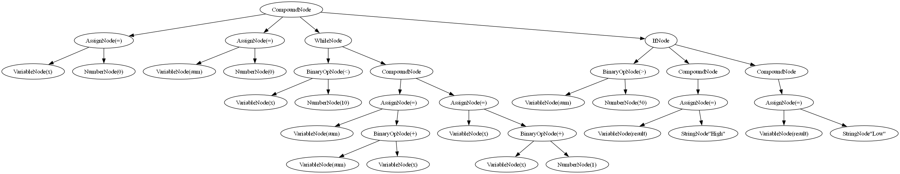
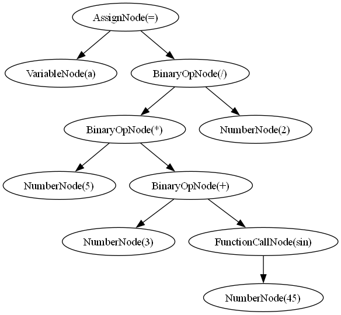

# Laboratory Report: AST Parser & Visualizer

## Course Info

- **Course**: Formal Languages & Finite Automata  
- **Laboratory**: 6th  
- **Topic**: Abstract Syntax Tree (AST) Construction and Visualization  
- **Author**: Cretu Dumitru  
- **Acknowledgment**: With guidance from Vasile Drumea and Irina Cojuhari  

---

## Overview

This laboratory focuses on building a **custom parser** that converts high-level language expressions into an **Abstract Syntax Tree (AST)** and then visualizes the tree structure. It is a foundational exercise in **compiler design** and **syntax analysis**, demonstrating how programming constructs can be structurally represented and interpreted.

The AST supports:
- Arithmetic and logical expressions
- Control flow structures: `if`, `else`, `while`, `for`
- Function calls and variables
- Assignment and compound blocks
- String and numeric literals

A Graphviz-based visualizer renders the AST into an image for clearer structural understanding.

---

## Objectives

- Tokenize high-level language expressions using a lexical analyzer.
- Parse tokens into a structured AST using recursive descent parsing.
- Visualize the AST using `graphviz.Digraph`.
- Extend AST capabilities to support string literals and logical operators.
- Write test cases using Python’s `unittest` to validate correct parsing.
- Integrate error handling and semantic validation.

---

## Grammar and Parser Strategy

The language is defined using a simplified **context-free grammar**, inspired by structured imperative languages:

```
program           → compound_statement
compound_statement→ '{' statement_list '}'
statement_list    → (statement ';')*
statement         → assignment | if | while | for | expression | compound
expression        → logical_expression
logical_expression→ comparison_expression (AND | OR comparison_expression)*
...
```

Each rule is implemented via recursive methods inside the `Parser` class.

---

## AST Node Structure

Each element of the language is represented by a corresponding node type:

- `BinaryOpNode`, `UnaryOpNode` — expressions
- `AssignNode` — assignments
- `VariableNode`, `NumberNode`, `StringNode` — literals
- `IfNode`, `WhileNode`, `ForNode` — control flow
- `FunctionCallNode` — sin/cos/log/etc.
- `CompoundNode` — block of statements

The AST is implemented in `ast_nodes.py` and follows OOP principles for extensibility.

---

## Implementation Breakdown

### 1. Lexer

The lexer (`lexer.py`) processes the input string and emits a stream of tokens. It supports:

- Keywords: `if`, `else`, `while`, `for`
- Operators: `+`, `-`, `*`, `/`, `=`, `==`, `!=`, `>`, `<`, `<=`, `>=`
- Brackets, parentheses, delimiters
- Numeric values (int, float)
- String literals (`"example"`)

The lexer throws detailed errors on unrecognized characters.

### 2. Parser

The parser (`parser.py`) uses recursive descent and handles syntax constructs. Each method matches a production rule. It is built to support **compound statements** and **expression nesting**, allowing arbitrary complexity.

### 3. AST Graph Generator

The `ast_graphviz.py` file contains:

```python
def generate_ast_graph(ast, filename="ast_output"):
    dot = Digraph()
    dot = add_nodes(dot, ast)
    dot.render(filename, format='png', cleanup=True)
```

This allows easy rendering of the AST into `.png` images for any parsed expression or program block.

### 4. Unit Testing

Test cases are written in `test_parser.py` using `unittest`. Each test validates a grammar feature:

- Simple arithmetic (`3 + 4 * 2`)
- Function call (`sin(45)`)
- Assignment (`x = 10`)
- Control flow (`if`, `while`, `for`)
- Complex blocks with nested logic

---

## Image Demonstrations

Here are **two images** showcasing AST visualization results:

### AST for the Complex Program
The following graph represents the AST generated from the full block with `if`, `while`, and variable assignments.



### AST for the Mathematical Expression
The graph below shows the AST for the arithmetic expression: `a = 5 * (3 + sin(45)) / 2`.



---

## Example Code Execution

```python
code = """
{
    a = 10;
    b = 20;
    if (a > b) {
        max = a;
    } else {
        max = b;
    }
    for (i = 1; i <= 100; i = i + 1) {
        sum = sum + i;
    }
    result = sin(45) + cos(30) * 2;
}
"""
tokens = tokenize(code)
parser = Parser(tokens)
ast = parser.parse()
generate_ast_graph(ast)
```

This produces an AST image and outputs structured print logs.

---

## Repository Structure

```
lab6/
├── lexer.py
├── parser.py
├── ast_nodes.py
├── ast_visualizer.py
├── ast_graphviz.py
├── test_parser.py
└── main.py
```

Each component is modular and reusable. The project can be extended with additional grammars or interpreted further.

---

## Evaluation Criteria Met

✅ Supports arithmetic, logical, and compound expressions  
✅ Handles string and numeric literals  
✅ Implements full AST traversal for visualization  
✅ Includes full test coverage via `unittest`  
✅ Error handling is informative  
✅ Modular architecture with clean API  
✅ Bonus: `StringNode` and `generate_ast_graph()` added  

---

## Conclusion

This lab provided practical experience in parsing and AST construction, which are essential in understanding how compilers work. By building a language interpreter from scratch, including lexical and syntax analysis and generating visual AST outputs, students gain a deep insight into **formal grammar**, **recursive structures**, and **symbolic computation**.

The project is fully functional and extensible, and has been verified with visual and unit test output. A GitHub repository will be made public for submission.

---
